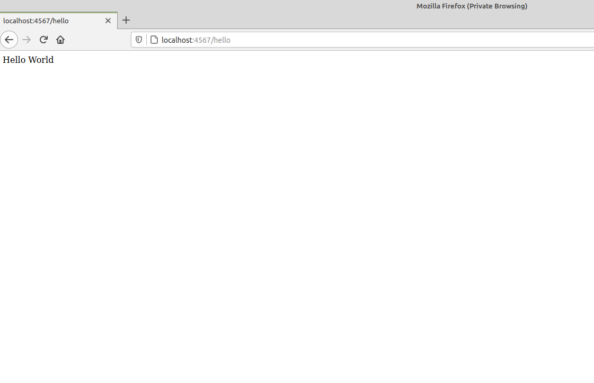

# HELLO WORLD SPARK APP

"Hello World" is displayed in your browser after you type in http://localhost/hello 


For this project, I am using
- Maven Build Tool
- Visual Studio Code

## What is Maven?
Maven is a build tool. It automates everything related to building and organizing a project, it uses a pom.xml file to manage 
dependencies (third party libraries your project depends on). When using a libary that isn't part of the Java Standard Library, you
need more than an "import" statement at the top of your java file. You have to either download the jar file or add it as a dependency 
to your pom.xml file (if you are using maven build tool). 

#### check if maven is already installed
```
$ mvn --version
```

#### Installing Maven on MacOS
You can use Homebrew:
```
$ brew install maven
```
#### Installing Maven on Linux
```
$ sudo apt-get install maven
```
Or you can just use this link: http://maven.apache.org/install.html 

#### Creating a maven project
You can easily generate a maven project with this command, making your root directory (or artifactId) "projectRootFolder" and your groupid "com.myFitnessApp" :
```
$ mvn archetype:generate -B -DgroupId=com.myFitnessApp -DartifactId=projectRootFolder
```
Keep in mind, if you create your project with this command, do not rename the App.java file. Your project will not compile if you rename App.java.<br />

Be sure to include an slf4j logging implementation in your maven dependencies in the pom.xml file. To compile it:
```
$ mvn compile
```
You will notice a newly created "target" directory that contains all of your .class files, such as App.class <br />
To create a .jar file inside the target directory, run this command:
```
$ mvn package
```
Run a goal from the "execute" plugin (exec), the goal name is Java. -Dexec.mainClass="<groupId.className>" <br />
To run the program:
```
$ mvn exec:java -Dexec.mainClass="com.myFitnessApp.App"
```
Type in this command to go to the directory where Maven is saving all the JARS of the dependencies you've used so far (if you want to see it):
```
$ cd ~/.m2
```
You can run maven commands from the terminal, however, all the major IDEs have built in support for Maven so you don't have to know all the maven commands. <br />

<br />
<br />
<br />

## What is Spark?
Spark is a Micro-framework that allows you to spin up a web server. Do not confuse the "Spark" framework with the database "Apache Spark".
They just happen to share the same name.<br />
<b>Documentation<b>: http://sparkjava.com/ 

## Step by step instructions for creating a hello world program using the Spark Framework.

- Create a folder called "first_spark_app"
- Navigate to the "first_spark_app" directory from the terminal.

Inside the first_spark_app directory:
- Create a new directory called "my_app" and navigate to that directory from the terminal.
- Inside the my_app directory, create a pom.xml file.

- Go to the documentation at http://sparkjava.com/tutorials/maven-setup and copy their example of a pom.xml file into your own. 

- Edit the artifactid to say "my_app" and groupid to say "com.leehaney" (add your own name instead of mine). Your artifactid is the root folder of your project. Your root
folder is what contains your pom.xml file and src folder. It is where you will compile
and run your project.

- Be sure to include the following dependency to your pom.xml dependencies:

        <dependency>
            <groupId>org.slf4j</groupId>
            <artifactId>slf4j-jdk14</artifactId>
            <version>1.7.30</version>
        </dependency>


- Add the following directories and java file with these commands (from the my_app directory):
$ mkdir src; mkdir src/main; mkdir src/main/java; mkdir src/main/java/com; mkdir src/main/java/com/leehaney; touch src/main/java/com/leehaney/App.java

### Add this code to your App.java file
        package com.leehaney;

        import static spark.Spark.*;

        public class App {
            public static void main(String[] args) {
                get("/hello", (req, res) -> "Hello World");
            }
        }

Run the following command (from the same folder as the pom.xml file) to compile.
```
$ mvn compile
```
(If needed) The clean command will delete all previously compiled Java.class files and resources.
```
$ mvn clean install
```
This command will run your application
```
$ mvn exec:java -Dexec.mainClass="com.leehaney.App"
```

TIP: Run this command to make it so you only have to type "run" in order to run the program from the terminal:
```
$ alias run='mvn exec:java -Dexec.mainClass="com.leehaney.App"' 
$ run 
```
NOTE: Make sure the top of the App.java file includes "package com.leehaney;" <br />


In the browser, type in: 
```
localhost:4567/hello
```
You should see "Hello World" on the screen

# How to use this project
Download this project from the terminal with 
```
$ git clone https://github.com/leeb2828/first_spark_app 
```
Inside the my_app directory (contains pom.xml file), run the following commands:
```
$ mvn compile
$ mvn exec:java -Dexec.mainClass="com.leehaney.App"
```
In the browser, type in 
```
localhost:4567/hello 
```
You should see "Hello World" on the screen


If you see the following error message:

SLF4J: Failed to load class "org.slf4j.impl.StaticLoggerBinder".<br>
SLF4J: Defaulting to no-operation (NOP) logger implementation<br>
SLF4J: See http://www.slf4j.org/codes.html#StaticLoggerBinder for further details.<br>

It means you need to include an slf4j logging implementation in your maven dependencies
For example, add the following to your pom.xml dependencies:

        <dependency>
            <groupId>org.slf4j</groupId>
            <artifactId>slf4j-jdk14</artifactId>
            <version>1.7.30</version>
        </dependency>
        
<br />
If you are using Gradle as your build tool instead, this gradle file should work for you: <br />

        plugins {
            id 'java'
        }

        group 'com.leehaney'
        version '1.0-SNAPSHOT'

        repositories {
            mavenCentral()
        }

        dependencies {
            compile 'com.sparkjava:spark-core:2.9.3'
            compile group: 'org.slf4j', name: 'slf4j-jdk14', version: '1.7.29'
            testImplementation 'org.junit.jupiter:junit-jupiter-api:5.6.0'
            testRuntimeOnly 'org.junit.jupiter:junit-jupiter-engine'
        }

        test {
            useJUnitPlatform()
        }

